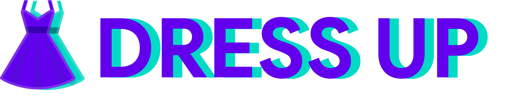
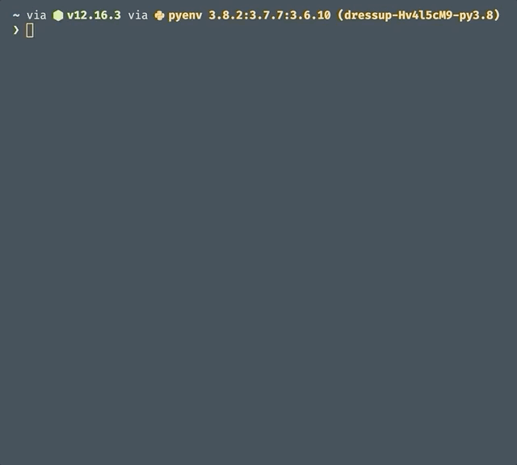

# Dress up



[](https://github.com/pscosta5/dressup/actions?workflow=Tests)
[](https://codecov.io/gh/pscosta5/dressup)
[](https://pypi.org/project/dressup/)
[](https://pypi.org/project/dressup)
[](https://dressup.readthedocs.io/)
[](https://opensource.org/licenses/MIT)
[](https://github.com/psf/black)

Convert your strings to various Unicode characters. Turn "words" into "𝔴𝔬𝔯𝔡𝔰", "🆆🅾🆁🅳🆂",
and "𝔀𝓸𝓻𝓭𝓼".



---

**Documentation:**
[https://dressup.readthedocs.io/](https://dressup.readthedocs.io/en/latest/)

---

## Contents

1. [**Installation**](#installation)
2. [**Usage**](#usage)
   - [**Command-line**](#command-line-usage)
   - [**Library**](#library-usage)
3. [**Contributing**](#contributing)

## Installation

To install Dress up, run this command in your terminal

```sh
❯ python -m pip install dressup
```

If you're using it primarily as a command-line tool, it's recommended you install it via
[pipx](https://github.com/pipxproject/pipx)

```sh
❯ pipx install dressup
```

## Usage

There are two primary ways to use Dress up—as a command-line tool, or as Python library.

### Command-line usage

Display all possible transformations by running:

```sh
❯ dressup Hello
Circle

Ⓗⓔⓛⓛⓞ

Negative circle

🅗🅔🅛🅛🅞

Monospace

Ｈｅｌｌｏ

Math bold

𝐇𝐞𝐥𝐥𝐨

...
```

Return only a specific transformation by using the `--type` flag.

```sh
❯ dressup Vibes --type inverted
𐌡ıqǝs
```

#### Autocompletion


Dress up supports argument completions along with live previews. To enable
autocompletion run.

```sh
❯ dressup --install-completion zsh
zsh completion installed in /Users/username/.zshrc.
```

Completion will take effect once you restart the terminal.

`zsh` may be replaced with `bash`, `fish`, `powershell`, or `pwsh`. Along with typical
autocompletion, when typing in a value for `--type` if `[TAB]` is pressed the matching
parameter values will be displayed below along with a preview of the conversion.

```sh
❯ dressup Words --type math [TAB]
math-bold              -- 𝐖𝐨𝐫𝐝𝐬
math-bold-fraktur      -- 𝖂𝖔𝖗𝖉𝖘
math-bold-italic       -- 𝑾𝒐𝒓𝒅𝒔
math-bold-script       -- 𝓦𝓸𝓻𝓭𝓼
math-double-struck     -- 𝕎𝕠𝕣𝕕𝕤
math-fraktur           -- 𝔚𝔬𝔯𝔡𝔰
math-monospace         -- 𝚆𝚘𝚛𝚍𝚜
math-sans              -- 𝖶𝗈𝗋𝖽𝗌
math-sans-bold         -- 𝗪𝗼𝗿𝗱𝘀
math-sans-bold-italic  -- 𝙒𝙤𝙧𝙙𝙨
math-sans-italic       -- 𝘞𝘰𝘳𝘥𝘴
```

## Library usage

To convert characters, use `convert`.

```python
import dressup

dressup.convert("Hello", unicode_type="negative circle")
```

```sh
'🅗🅔🅛🅛🅞'
```

To return all possible conversions, use `show_all`.

```python
import dressup

dressup.show_all("Hello")
```

```sh
{'Circle': 'Ⓗⓔⓛⓛⓞ', 'Negative circle': '🅗🅔🅛🅛🅞',
'Monospace': 'Ｈｅｌｌｏ', 'Math bold': '𝐇𝐞𝐥𝐥𝐨',
'Math bold fraktur': '𝕳𝖊𝖑𝖑𝖔', 'Math bold italic': '𝑯𝒆𝒍𝒍𝒐',
'Math bold script': '𝓗𝓮𝓵𝓵𝓸', 'Math double struck': 'ℍ𝕖𝕝𝕝𝕠',
'Math monospace': '𝙷𝚎𝚕𝚕𝚘', 'Math sans': '𝖧𝖾𝗅𝗅𝗈', 'Math sans bold':
'𝗛𝗲𝗹𝗹𝗼', 'Math sans bold italic': '𝙃𝙚𝙡𝙡𝙤', 'Math sans italic':
'𝘏𝘦𝘭𝘭𝘰', 'Parenthesized': '⒣⒠⒧⒧⒪', 'Square': '🄷🄴🄻🄻🄾',
'Negative square': '🅷🅴🅻🅻🅾', 'Cute': 'Héĺĺő', 'Math fraktur':
'ℌ𝔢𝔩𝔩𝔬', 'Rock dots': 'Ḧëḷḷö', 'Small caps': 'ʜᴇʟʟᴏ', 'Stroked':
'Ħɇłłø', 'Subscript': 'ₕₑₗₗₒ', 'Superscript': 'ᴴᵉˡˡᵒ',
'Inverted': 'ɥǝןןo', 'Reversed': 'Hɘ⅃⅃o'}
```

## Contributing

All character mappings are stored in [translator.toml](src/dressup/translator.toml).
Want to add a new mapping or tweak an existing one? Simply edit
[translator.toml](src/dressup/translator.toml) and create a pull request.

Check out [CONTRIBUTING.md](CONTRIBUTING.md) for general contribution guidelines.
